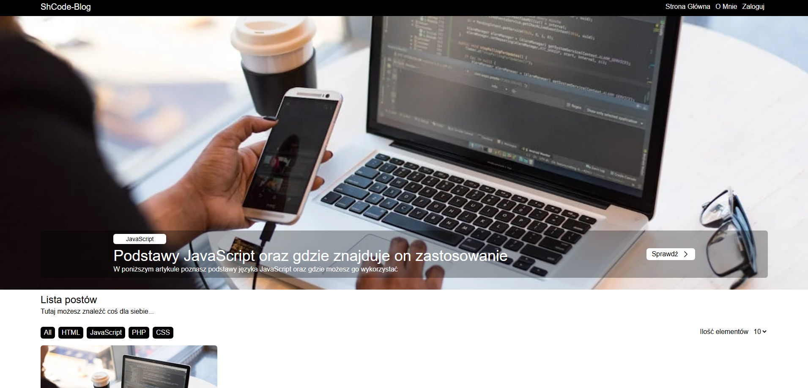
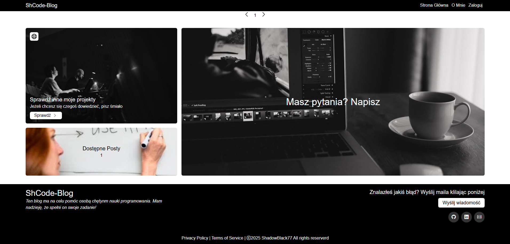
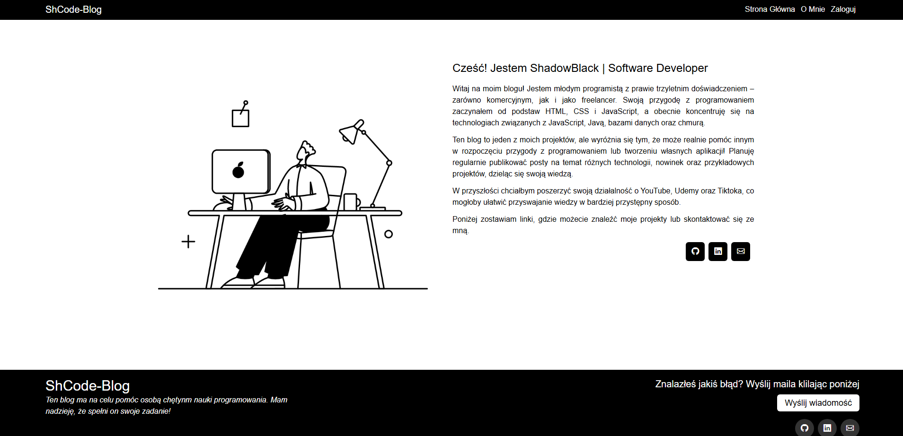
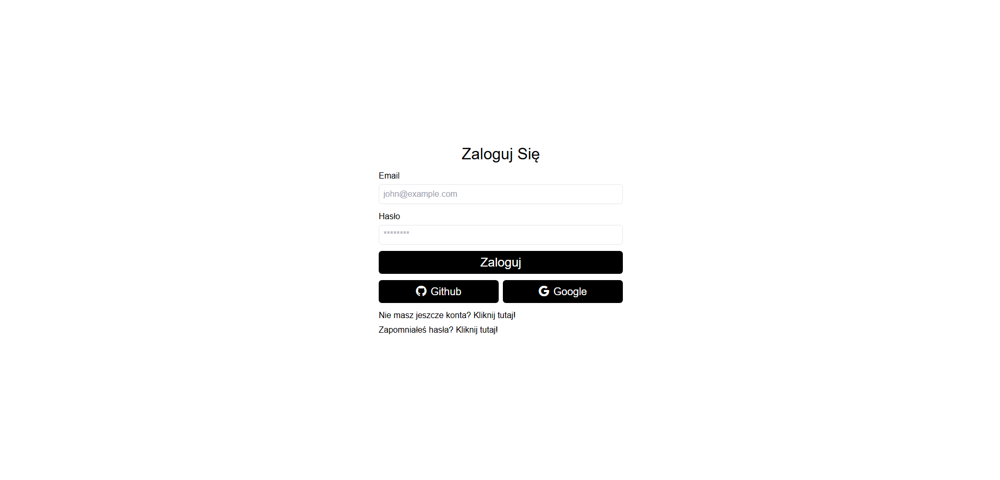
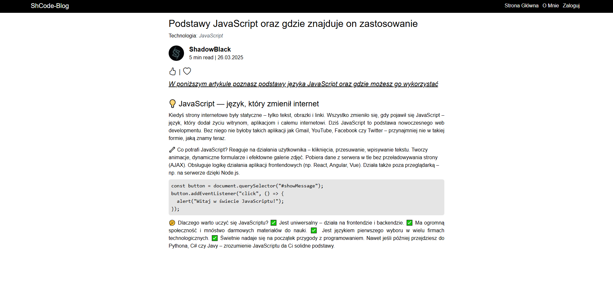

# 💻 ShCodeBlog

My personal blog, where I plan to post programming-related posts in the future.

## 🛠️ Technologies

- Angular 19
- NestJS 11
- TypeScript
- TailwindCSS
- Firebase
- Nx
- Docker
- Render.com (hosting)

## 🎯 Features

- ✅ Home page with possibility to filter posts
- ✅ Advanced Authorization & Authentication (JWT with Refresh Token passed by cookies)
- ✅ OAuth2 (Google & Github providers)
- ✅ Page with selected post
- ✅ Possibility to reset password (Mailing System)
- ✅ Responsive design
- ✅ API Secure
- ✅ Use store tools on frontend (NgRX)
- ✅ Docker
- ✅ Advanced architecture of appliaction (Frontend and Backend)

## 🌐 Demo
- 🔗 [https://shcodeblog.onrender.com/#/](https://shcodeblog.onrender.com/#/)

## 🧠 Author
- Daniel Miliczek
- GitHub: @ShadowBlack77

## 📸 Screenshots

